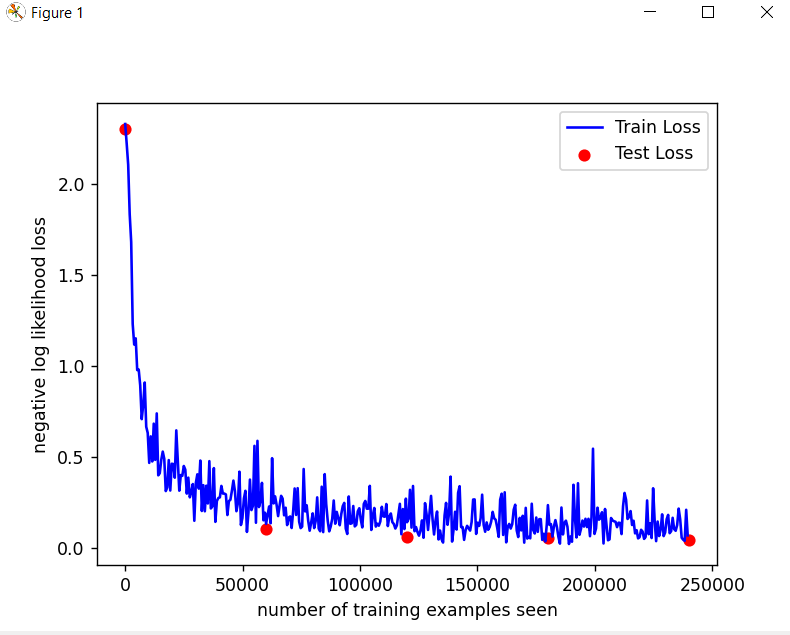

```
C:\phuc\AI\ai\homework\7>python -W ignore train.py lenet

Test set: Avg. loss: 2.3004, Accuracy: 797/10000 (8%)

Train Epoch: 1 [0/60000 (0%)]   Loss: 2.328166
Train Epoch: 1 [640/60000 (1%)] Loss: 2.220700
Train Epoch: 1 [1280/60000 (2%)]        Loss: 2.104568
Train Epoch: 1 [1920/60000 (3%)]        Loss: 1.833286
Train Epoch: 1 [2560/60000 (4%)]        Loss: 1.680220
Train Epoch: 1 [3200/60000 (5%)]        Loss: 1.230223
Train Epoch: 1 [3840/60000 (6%)]        Loss: 1.117778
Train Epoch: 1 [4480/60000 (7%)]        Loss: 1.151738
Train Epoch: 1 [5120/60000 (9%)]        Loss: 0.977797
Train Epoch: 1 [5760/60000 (10%)]       Loss: 0.980271
Train Epoch: 1 [6400/60000 (11%)]       Loss: 0.893620
Train Epoch: 1 [7040/60000 (12%)]       Loss: 0.708237
Train Epoch: 1 [7680/60000 (13%)]       Loss: 0.785988
Train Epoch: 1 [8320/60000 (14%)]       Loss: 0.909396
Train Epoch: 1 [8960/60000 (15%)]       Loss: 0.666578
Train Epoch: 1 [9600/60000 (16%)]       Loss: 0.632450
Train Epoch: 1 [10240/60000 (17%)]      Loss: 0.468214
Train Epoch: 1 [10880/60000 (18%)]      Loss: 0.613736
Train Epoch: 1 [11520/60000 (19%)]      Loss: 0.476036
Train Epoch: 1 [12160/60000 (20%)]      Loss: 0.683599
Train Epoch: 1 [12800/60000 (21%)]      Loss: 0.484730
Train Epoch: 1 [13440/60000 (22%)]      Loss: 0.739789
Train Epoch: 1 [14080/60000 (23%)]      Loss: 0.399909
Train Epoch: 1 [14720/60000 (25%)]      Loss: 0.411457
Train Epoch: 1 [15360/60000 (26%)]      Loss: 0.484694
Train Epoch: 1 [16000/60000 (27%)]      Loss: 0.530194
Train Epoch: 1 [16640/60000 (28%)]      Loss: 0.490534
Train Epoch: 1 [17280/60000 (29%)]      Loss: 0.313596
Train Epoch: 1 [17920/60000 (30%)]      Loss: 0.333750
Train Epoch: 1 [18560/60000 (31%)]      Loss: 0.483645
Train Epoch: 1 [19200/60000 (32%)]      Loss: 0.316530
Train Epoch: 1 [19840/60000 (33%)]      Loss: 0.463448
Train Epoch: 1 [20480/60000 (34%)]      Loss: 0.461906
Train Epoch: 1 [21120/60000 (35%)]      Loss: 0.386943
Train Epoch: 1 [21760/60000 (36%)]      Loss: 0.646739
Train Epoch: 1 [22400/60000 (37%)]      Loss: 0.485245
Train Epoch: 1 [23040/60000 (38%)]      Loss: 0.315611
Train Epoch: 1 [23680/60000 (39%)]      Loss: 0.401467
Train Epoch: 1 [24320/60000 (41%)]      Loss: 0.397045
Train Epoch: 1 [24960/60000 (42%)]      Loss: 0.451102
Train Epoch: 1 [25600/60000 (43%)]      Loss: 0.431029
Train Epoch: 1 [26240/60000 (44%)]      Loss: 0.299575
Train Epoch: 1 [26880/60000 (45%)]      Loss: 0.387219
Train Epoch: 1 [27520/60000 (46%)]      Loss: 0.279204
Train Epoch: 1 [28160/60000 (47%)]      Loss: 0.309373
Train Epoch: 1 [28800/60000 (48%)]      Loss: 0.352090
Train Epoch: 1 [29440/60000 (49%)]      Loss: 0.150467
Train Epoch: 1 [30080/60000 (50%)]      Loss: 0.357014
Train Epoch: 1 [30720/60000 (51%)]      Loss: 0.405436
Train Epoch: 1 [31360/60000 (52%)]      Loss: 0.326837
Train Epoch: 1 [32000/60000 (53%)]      Loss: 0.481115
Train Epoch: 1 [32640/60000 (54%)]      Loss: 0.204149
Train Epoch: 1 [33280/60000 (55%)]      Loss: 0.345779
Train Epoch: 1 [33920/60000 (57%)]      Loss: 0.202535
Train Epoch: 1 [34560/60000 (58%)]      Loss: 0.343095
Train Epoch: 1 [35200/60000 (59%)]      Loss: 0.245480
Train Epoch: 1 [35840/60000 (60%)]      Loss: 0.477864
Train Epoch: 1 [36480/60000 (61%)]      Loss: 0.218042
Train Epoch: 1 [37120/60000 (62%)]      Loss: 0.229538
Train Epoch: 1 [37760/60000 (63%)]      Loss: 0.439642
Train Epoch: 1 [38400/60000 (64%)]      Loss: 0.144522
Train Epoch: 1 [39040/60000 (65%)]      Loss: 0.259163
Train Epoch: 1 [39680/60000 (66%)]      Loss: 0.275600
Train Epoch: 1 [40320/60000 (67%)]      Loss: 0.279161
Train Epoch: 1 [40960/60000 (68%)]      Loss: 0.341828
Train Epoch: 1 [41600/60000 (69%)]      Loss: 0.299962
Train Epoch: 1 [42240/60000 (70%)]      Loss: 0.299738
Train Epoch: 1 [42880/60000 (71%)]      Loss: 0.294918
Train Epoch: 1 [43520/60000 (72%)]      Loss: 0.181986
Train Epoch: 1 [44160/60000 (74%)]      Loss: 0.258628
Train Epoch: 1 [44800/60000 (75%)]      Loss: 0.265689
Train Epoch: 1 [45440/60000 (76%)]      Loss: 0.314506
Train Epoch: 1 [46080/60000 (77%)]      Loss: 0.371085
Train Epoch: 1 [46720/60000 (78%)]      Loss: 0.314323
Train Epoch: 1 [47360/60000 (79%)]      Loss: 0.203055
Train Epoch: 1 [48000/60000 (80%)]      Loss: 0.248149
Train Epoch: 1 [48640/60000 (81%)]      Loss: 0.419936
Train Epoch: 1 [49280/60000 (82%)]      Loss: 0.127316
Train Epoch: 1 [49920/60000 (83%)]      Loss: 0.165515
Train Epoch: 1 [50560/60000 (84%)]      Loss: 0.273191
Train Epoch: 1 [51200/60000 (85%)]      Loss: 0.315053
Train Epoch: 1 [51840/60000 (86%)]      Loss: 0.089265
Train Epoch: 1 [52480/60000 (87%)]      Loss: 0.194353
Train Epoch: 1 [53120/60000 (88%)]      Loss: 0.376555
Train Epoch: 1 [53760/60000 (90%)]      Loss: 0.209288
Train Epoch: 1 [54400/60000 (91%)]      Loss: 0.232501
Train Epoch: 1 [55040/60000 (92%)]      Loss: 0.561704
Train Epoch: 1 [55680/60000 (93%)]      Loss: 0.139551
Train Epoch: 1 [56320/60000 (94%)]      Loss: 0.589188
Train Epoch: 1 [56960/60000 (95%)]      Loss: 0.225802
Train Epoch: 1 [57600/60000 (96%)]      Loss: 0.257590
Train Epoch: 1 [58240/60000 (97%)]      Loss: 0.358586
Train Epoch: 1 [58880/60000 (98%)]      Loss: 0.153044
Train Epoch: 1 [59520/60000 (99%)]      Loss: 0.194651

Test set: Avg. loss: 0.1035, Accuracy: 9660/10000 (97%)

Train Epoch: 2 [0/60000 (0%)]   Loss: 0.133841
Train Epoch: 2 [640/60000 (1%)] Loss: 0.180970
Train Epoch: 2 [1280/60000 (2%)]        Loss: 0.228730
Train Epoch: 2 [1920/60000 (3%)]        Loss: 0.136916
Train Epoch: 2 [2560/60000 (4%)]        Loss: 0.494052
Train Epoch: 2 [3200/60000 (5%)]        Loss: 0.245819
Train Epoch: 2 [3840/60000 (6%)]        Loss: 0.284404
Train Epoch: 2 [4480/60000 (7%)]        Loss: 0.237691
Train Epoch: 2 [5120/60000 (9%)]        Loss: 0.176177
Train Epoch: 2 [5760/60000 (10%)]       Loss: 0.235634
Train Epoch: 2 [6400/60000 (11%)]       Loss: 0.287546
Train Epoch: 2 [7040/60000 (12%)]       Loss: 0.272130
Train Epoch: 2 [7680/60000 (13%)]       Loss: 0.180450
Train Epoch: 2 [8320/60000 (14%)]       Loss: 0.222188
Train Epoch: 2 [8960/60000 (15%)]       Loss: 0.126805
Train Epoch: 2 [9600/60000 (16%)]       Loss: 0.167502
Train Epoch: 2 [10240/60000 (17%)]      Loss: 0.174284
Train Epoch: 2 [10880/60000 (18%)]      Loss: 0.110837
Train Epoch: 2 [11520/60000 (19%)]      Loss: 0.201743
Train Epoch: 2 [12160/60000 (20%)]      Loss: 0.327828
Train Epoch: 2 [12800/60000 (21%)]      Loss: 0.182526
Train Epoch: 2 [13440/60000 (22%)]      Loss: 0.329519
Train Epoch: 2 [14080/60000 (23%)]      Loss: 0.144986
Train Epoch: 2 [14720/60000 (25%)]      Loss: 0.110210
Train Epoch: 2 [15360/60000 (26%)]      Loss: 0.118443
Train Epoch: 2 [16000/60000 (27%)]      Loss: 0.434675
Train Epoch: 2 [16640/60000 (28%)]      Loss: 0.201845
Train Epoch: 2 [17280/60000 (29%)]      Loss: 0.235585
Train Epoch: 2 [17920/60000 (30%)]      Loss: 0.151434
Train Epoch: 2 [18560/60000 (31%)]      Loss: 0.096057
Train Epoch: 2 [19200/60000 (32%)]      Loss: 0.141178
Train Epoch: 2 [19840/60000 (33%)]      Loss: 0.191076
Train Epoch: 2 [20480/60000 (34%)]      Loss: 0.110292
Train Epoch: 2 [21120/60000 (35%)]      Loss: 0.149678
Train Epoch: 2 [21760/60000 (36%)]      Loss: 0.278994
Train Epoch: 2 [22400/60000 (37%)]      Loss: 0.107793
Train Epoch: 2 [23040/60000 (38%)]      Loss: 0.092994
Train Epoch: 2 [23680/60000 (39%)]      Loss: 0.337582
Train Epoch: 2 [24320/60000 (41%)]      Loss: 0.088213
Train Epoch: 2 [24960/60000 (42%)]      Loss: 0.406536
Train Epoch: 2 [25600/60000 (43%)]      Loss: 0.241573
Train Epoch: 2 [26240/60000 (44%)]      Loss: 0.150804
Train Epoch: 2 [26880/60000 (45%)]      Loss: 0.092550
Train Epoch: 2 [27520/60000 (46%)]      Loss: 0.119289
Train Epoch: 2 [28160/60000 (47%)]      Loss: 0.161190
Train Epoch: 2 [28800/60000 (48%)]      Loss: 0.261847
Train Epoch: 2 [29440/60000 (49%)]      Loss: 0.134359
Train Epoch: 2 [30080/60000 (50%)]      Loss: 0.199247
Train Epoch: 2 [30720/60000 (51%)]      Loss: 0.165888
Train Epoch: 2 [31360/60000 (52%)]      Loss: 0.126051
Train Epoch: 2 [32000/60000 (53%)]      Loss: 0.186110
Train Epoch: 2 [32640/60000 (54%)]      Loss: 0.230632
Train Epoch: 2 [33280/60000 (55%)]      Loss: 0.248569
Train Epoch: 2 [33920/60000 (57%)]      Loss: 0.108030
Train Epoch: 2 [34560/60000 (58%)]      Loss: 0.078058
Train Epoch: 2 [35200/60000 (59%)]      Loss: 0.283944
Train Epoch: 2 [35840/60000 (60%)]      Loss: 0.134086
Train Epoch: 2 [36480/60000 (61%)]      Loss: 0.136527
Train Epoch: 2 [37120/60000 (62%)]      Loss: 0.231576
Train Epoch: 2 [37760/60000 (63%)]      Loss: 0.119575
Train Epoch: 2 [38400/60000 (64%)]      Loss: 0.128108
Train Epoch: 2 [39040/60000 (65%)]      Loss: 0.202226
Train Epoch: 2 [39680/60000 (66%)]      Loss: 0.219094
Train Epoch: 2 [40320/60000 (67%)]      Loss: 0.157624
Train Epoch: 2 [40960/60000 (68%)]      Loss: 0.114040
Train Epoch: 2 [41600/60000 (69%)]      Loss: 0.242499
Train Epoch: 2 [42240/60000 (70%)]      Loss: 0.259428
Train Epoch: 2 [42880/60000 (71%)]      Loss: 0.216950
Train Epoch: 2 [43520/60000 (72%)]      Loss: 0.216941
Train Epoch: 2 [44160/60000 (74%)]      Loss: 0.342141
Train Epoch: 2 [44800/60000 (75%)]      Loss: 0.100083
Train Epoch: 2 [45440/60000 (76%)]      Loss: 0.178463
Train Epoch: 2 [46080/60000 (77%)]      Loss: 0.220765
Train Epoch: 2 [46720/60000 (78%)]      Loss: 0.118762
Train Epoch: 2 [47360/60000 (79%)]      Loss: 0.134408
Train Epoch: 2 [48000/60000 (80%)]      Loss: 0.123432
Train Epoch: 2 [48640/60000 (81%)]      Loss: 0.147017
Train Epoch: 2 [49280/60000 (82%)]      Loss: 0.227177
Train Epoch: 2 [49920/60000 (83%)]      Loss: 0.174491
Train Epoch: 2 [50560/60000 (84%)]      Loss: 0.172757
Train Epoch: 2 [51200/60000 (85%)]      Loss: 0.242446
Train Epoch: 2 [51840/60000 (86%)]      Loss: 0.121510
Train Epoch: 2 [52480/60000 (87%)]      Loss: 0.173730
Train Epoch: 2 [53120/60000 (88%)]      Loss: 0.190593
Train Epoch: 2 [53760/60000 (90%)]      Loss: 0.143217
Train Epoch: 2 [54400/60000 (91%)]      Loss: 0.132634
Train Epoch: 2 [55040/60000 (92%)]      Loss: 0.107854
Train Epoch: 2 [55680/60000 (93%)]      Loss: 0.125392
Train Epoch: 2 [56320/60000 (94%)]      Loss: 0.183599
Train Epoch: 2 [56960/60000 (95%)]      Loss: 0.243574
Train Epoch: 2 [57600/60000 (96%)]      Loss: 0.076470
Train Epoch: 2 [58240/60000 (97%)]      Loss: 0.214913
Train Epoch: 2 [58880/60000 (98%)]      Loss: 0.105016
Train Epoch: 2 [59520/60000 (99%)]      Loss: 0.271947

Test set: Avg. loss: 0.0638, Accuracy: 9792/10000 (98%)

Train Epoch: 3 [0/60000 (0%)]   Loss: 0.142634
Train Epoch: 3 [640/60000 (1%)] Loss: 0.160659
Train Epoch: 3 [1280/60000 (2%)]        Loss: 0.320436
Train Epoch: 3 [1920/60000 (3%)]        Loss: 0.112882
Train Epoch: 3 [2560/60000 (4%)]        Loss: 0.341524
Train Epoch: 3 [3200/60000 (5%)]        Loss: 0.093286
Train Epoch: 3 [3840/60000 (6%)]        Loss: 0.116061
Train Epoch: 3 [4480/60000 (7%)]        Loss: 0.087764
Train Epoch: 3 [5120/60000 (9%)]        Loss: 0.068665
Train Epoch: 3 [5760/60000 (10%)]       Loss: 0.099271
Train Epoch: 3 [6400/60000 (11%)]       Loss: 0.152639
Train Epoch: 3 [7040/60000 (12%)]       Loss: 0.057310
Train Epoch: 3 [7680/60000 (13%)]       Loss: 0.247228
Train Epoch: 3 [8320/60000 (14%)]       Loss: 0.187631
Train Epoch: 3 [8960/60000 (15%)]       Loss: 0.100147
Train Epoch: 3 [9600/60000 (16%)]       Loss: 0.193397
Train Epoch: 3 [10240/60000 (17%)]      Loss: 0.287107
Train Epoch: 3 [10880/60000 (18%)]      Loss: 0.158770
Train Epoch: 3 [11520/60000 (19%)]      Loss: 0.075316
Train Epoch: 3 [12160/60000 (20%)]      Loss: 0.153330
Train Epoch: 3 [12800/60000 (21%)]      Loss: 0.201175
Train Epoch: 3 [13440/60000 (22%)]      Loss: 0.047926
Train Epoch: 3 [14080/60000 (23%)]      Loss: 0.096798
Train Epoch: 3 [14720/60000 (25%)]      Loss: 0.048665
Train Epoch: 3 [15360/60000 (26%)]      Loss: 0.031101
Train Epoch: 3 [16000/60000 (27%)]      Loss: 0.179604
Train Epoch: 3 [16640/60000 (28%)]      Loss: 0.248673
Train Epoch: 3 [17280/60000 (29%)]      Loss: 0.128548
Train Epoch: 3 [17920/60000 (30%)]      Loss: 0.193964
Train Epoch: 3 [18560/60000 (31%)]      Loss: 0.392985
Train Epoch: 3 [19200/60000 (32%)]      Loss: 0.036446
Train Epoch: 3 [19840/60000 (33%)]      Loss: 0.103097
Train Epoch: 3 [20480/60000 (34%)]      Loss: 0.200088
Train Epoch: 3 [21120/60000 (35%)]      Loss: 0.102250
Train Epoch: 3 [21760/60000 (36%)]      Loss: 0.304049
Train Epoch: 3 [22400/60000 (37%)]      Loss: 0.340294
Train Epoch: 3 [23040/60000 (38%)]      Loss: 0.115996
Train Epoch: 3 [23680/60000 (39%)]      Loss: 0.115963
Train Epoch: 3 [24320/60000 (41%)]      Loss: 0.045607
Train Epoch: 3 [24960/60000 (42%)]      Loss: 0.099162
Train Epoch: 3 [25600/60000 (43%)]      Loss: 0.122760
Train Epoch: 3 [26240/60000 (44%)]      Loss: 0.110136
Train Epoch: 3 [26880/60000 (45%)]      Loss: 0.096491
Train Epoch: 3 [27520/60000 (46%)]      Loss: 0.144217
Train Epoch: 3 [28160/60000 (47%)]      Loss: 0.267058
Train Epoch: 3 [28800/60000 (48%)]      Loss: 0.267759
Train Epoch: 3 [29440/60000 (49%)]      Loss: 0.078402
Train Epoch: 3 [30080/60000 (50%)]      Loss: 0.140003
Train Epoch: 3 [30720/60000 (51%)]      Loss: 0.122223
Train Epoch: 3 [31360/60000 (52%)]      Loss: 0.165103
Train Epoch: 3 [32000/60000 (53%)]      Loss: 0.293749
Train Epoch: 3 [32640/60000 (54%)]      Loss: 0.128172
Train Epoch: 3 [33280/60000 (55%)]      Loss: 0.090311
Train Epoch: 3 [33920/60000 (57%)]      Loss: 0.141486
Train Epoch: 3 [34560/60000 (58%)]      Loss: 0.100955
Train Epoch: 3 [35200/60000 (59%)]      Loss: 0.116097
Train Epoch: 3 [35840/60000 (60%)]      Loss: 0.146036
Train Epoch: 3 [36480/60000 (61%)]      Loss: 0.199499
Train Epoch: 3 [37120/60000 (62%)]      Loss: 0.164177
Train Epoch: 3 [37760/60000 (63%)]      Loss: 0.155782
Train Epoch: 3 [38400/60000 (64%)]      Loss: 0.113588
Train Epoch: 3 [39040/60000 (65%)]      Loss: 0.062065
Train Epoch: 3 [39680/60000 (66%)]      Loss: 0.266734
Train Epoch: 3 [40320/60000 (67%)]      Loss: 0.299083
Train Epoch: 3 [40960/60000 (68%)]      Loss: 0.072669
Train Epoch: 3 [41600/60000 (69%)]      Loss: 0.306936
Train Epoch: 3 [42240/60000 (70%)]      Loss: 0.032109
Train Epoch: 3 [42880/60000 (71%)]      Loss: 0.117439
Train Epoch: 3 [43520/60000 (72%)]      Loss: 0.133307
Train Epoch: 3 [44160/60000 (74%)]      Loss: 0.107785
Train Epoch: 3 [44800/60000 (75%)]      Loss: 0.131294
Train Epoch: 3 [45440/60000 (76%)]      Loss: 0.211520
Train Epoch: 3 [46080/60000 (77%)]      Loss: 0.238532
Train Epoch: 3 [46720/60000 (78%)]      Loss: 0.097193
Train Epoch: 3 [47360/60000 (79%)]      Loss: 0.061223
Train Epoch: 3 [48000/60000 (80%)]      Loss: 0.166545
Train Epoch: 3 [48640/60000 (81%)]      Loss: 0.097572
Train Epoch: 3 [49280/60000 (82%)]      Loss: 0.177818
Train Epoch: 3 [49920/60000 (83%)]      Loss: 0.030433
Train Epoch: 3 [50560/60000 (84%)]      Loss: 0.221463
Train Epoch: 3 [51200/60000 (85%)]      Loss: 0.052723
Train Epoch: 3 [51840/60000 (86%)]      Loss: 0.062229
Train Epoch: 3 [52480/60000 (87%)]      Loss: 0.054109
Train Epoch: 3 [53120/60000 (88%)]      Loss: 0.244144
Train Epoch: 3 [53760/60000 (90%)]      Loss: 0.099257
Train Epoch: 3 [54400/60000 (91%)]      Loss: 0.080885
Train Epoch: 3 [55040/60000 (92%)]      Loss: 0.168423
Train Epoch: 3 [55680/60000 (93%)]      Loss: 0.089731
Train Epoch: 3 [56320/60000 (94%)]      Loss: 0.159414
Train Epoch: 3 [56960/60000 (95%)]      Loss: 0.159403
Train Epoch: 3 [57600/60000 (96%)]      Loss: 0.045590
Train Epoch: 3 [58240/60000 (97%)]      Loss: 0.078998
Train Epoch: 3 [58880/60000 (98%)]      Loss: 0.036907
Train Epoch: 3 [59520/60000 (99%)]      Loss: 0.129854

Test set: Avg. loss: 0.0565, Accuracy: 9811/10000 (98%)

Train Epoch: 4 [0/60000 (0%)]   Loss: 0.236475
Train Epoch: 4 [640/60000 (1%)] Loss: 0.128143
Train Epoch: 4 [1280/60000 (2%)]        Loss: 0.132373
Train Epoch: 4 [1920/60000 (3%)]        Loss: 0.063337
Train Epoch: 4 [2560/60000 (4%)]        Loss: 0.119632
Train Epoch: 4 [3200/60000 (5%)]        Loss: 0.154074
Train Epoch: 4 [3840/60000 (6%)]        Loss: 0.115383
Train Epoch: 4 [4480/60000 (7%)]        Loss: 0.061781
Train Epoch: 4 [5120/60000 (9%)]        Loss: 0.025160
Train Epoch: 4 [5760/60000 (10%)]       Loss: 0.223286
Train Epoch: 4 [6400/60000 (11%)]       Loss: 0.075588
Train Epoch: 4 [7040/60000 (12%)]       Loss: 0.139452
Train Epoch: 4 [7680/60000 (13%)]       Loss: 0.151173
Train Epoch: 4 [8320/60000 (14%)]       Loss: 0.117717
Train Epoch: 4 [8960/60000 (15%)]       Loss: 0.023039
Train Epoch: 4 [9600/60000 (16%)]       Loss: 0.063964
Train Epoch: 4 [10240/60000 (17%)]      Loss: 0.035502
Train Epoch: 4 [10880/60000 (18%)]      Loss: 0.348161
Train Epoch: 4 [11520/60000 (19%)]      Loss: 0.161900
Train Epoch: 4 [12160/60000 (20%)]      Loss: 0.058951
Train Epoch: 4 [12800/60000 (21%)]      Loss: 0.356607
Train Epoch: 4 [13440/60000 (22%)]      Loss: 0.073532
Train Epoch: 4 [14080/60000 (23%)]      Loss: 0.106546
Train Epoch: 4 [14720/60000 (25%)]      Loss: 0.151776
Train Epoch: 4 [15360/60000 (26%)]      Loss: 0.118697
Train Epoch: 4 [16000/60000 (27%)]      Loss: 0.161431
Train Epoch: 4 [16640/60000 (28%)]      Loss: 0.115926
Train Epoch: 4 [17280/60000 (29%)]      Loss: 0.161444
Train Epoch: 4 [17920/60000 (30%)]      Loss: 0.065860
Train Epoch: 4 [18560/60000 (31%)]      Loss: 0.170372
Train Epoch: 4 [19200/60000 (32%)]      Loss: 0.546072
Train Epoch: 4 [19840/60000 (33%)]      Loss: 0.078383
Train Epoch: 4 [20480/60000 (34%)]      Loss: 0.108113
Train Epoch: 4 [21120/60000 (35%)]      Loss: 0.222297
Train Epoch: 4 [21760/60000 (36%)]      Loss: 0.156401
Train Epoch: 4 [22400/60000 (37%)]      Loss: 0.167267
Train Epoch: 4 [23040/60000 (38%)]      Loss: 0.197308
Train Epoch: 4 [23680/60000 (39%)]      Loss: 0.025914
Train Epoch: 4 [24320/60000 (41%)]      Loss: 0.215262
Train Epoch: 4 [24960/60000 (42%)]      Loss: 0.125223
Train Epoch: 4 [25600/60000 (43%)]      Loss: 0.043476
Train Epoch: 4 [26240/60000 (44%)]      Loss: 0.048458
Train Epoch: 4 [26880/60000 (45%)]      Loss: 0.165815
Train Epoch: 4 [27520/60000 (46%)]      Loss: 0.152786
Train Epoch: 4 [28160/60000 (47%)]      Loss: 0.147729
Train Epoch: 4 [28800/60000 (48%)]      Loss: 0.144897
Train Epoch: 4 [29440/60000 (49%)]      Loss: 0.115658
Train Epoch: 4 [30080/60000 (50%)]      Loss: 0.139945
Train Epoch: 4 [30720/60000 (51%)]      Loss: 0.138709
Train Epoch: 4 [31360/60000 (52%)]      Loss: 0.077430
Train Epoch: 4 [32000/60000 (53%)]      Loss: 0.230839
Train Epoch: 4 [32640/60000 (54%)]      Loss: 0.303349
Train Epoch: 4 [33280/60000 (55%)]      Loss: 0.265813
Train Epoch: 4 [33920/60000 (57%)]      Loss: 0.160352
Train Epoch: 4 [34560/60000 (58%)]      Loss: 0.171564
Train Epoch: 4 [35200/60000 (59%)]      Loss: 0.203737
Train Epoch: 4 [35840/60000 (60%)]      Loss: 0.127364
Train Epoch: 4 [36480/60000 (61%)]      Loss: 0.150646
Train Epoch: 4 [37120/60000 (62%)]      Loss: 0.081463
Train Epoch: 4 [37760/60000 (63%)]      Loss: 0.099131
Train Epoch: 4 [38400/60000 (64%)]      Loss: 0.053891
Train Epoch: 4 [39040/60000 (65%)]      Loss: 0.060450
Train Epoch: 4 [39680/60000 (66%)]      Loss: 0.101122
Train Epoch: 4 [40320/60000 (67%)]      Loss: 0.091066
Train Epoch: 4 [40960/60000 (68%)]      Loss: 0.051061
Train Epoch: 4 [41600/60000 (69%)]      Loss: 0.061850
Train Epoch: 4 [42240/60000 (70%)]      Loss: 0.262030
Train Epoch: 4 [42880/60000 (71%)]      Loss: 0.076683
Train Epoch: 4 [43520/60000 (72%)]      Loss: 0.136470
Train Epoch: 4 [44160/60000 (74%)]      Loss: 0.055742
Train Epoch: 4 [44800/60000 (75%)]      Loss: 0.328882
Train Epoch: 4 [45440/60000 (76%)]      Loss: 0.154210
Train Epoch: 4 [46080/60000 (77%)]      Loss: 0.038736
Train Epoch: 4 [46720/60000 (78%)]      Loss: 0.146372
Train Epoch: 4 [47360/60000 (79%)]      Loss: 0.066739
Train Epoch: 4 [48000/60000 (80%)]      Loss: 0.101864
Train Epoch: 4 [48640/60000 (81%)]      Loss: 0.185801
Train Epoch: 4 [49280/60000 (82%)]      Loss: 0.066458
Train Epoch: 4 [49920/60000 (83%)]      Loss: 0.086120
Train Epoch: 4 [50560/60000 (84%)]      Loss: 0.158843
Train Epoch: 4 [51200/60000 (85%)]      Loss: 0.182730
Train Epoch: 4 [51840/60000 (86%)]      Loss: 0.082364
Train Epoch: 4 [52480/60000 (87%)]      Loss: 0.093357
Train Epoch: 4 [53120/60000 (88%)]      Loss: 0.166858
Train Epoch: 4 [53760/60000 (90%)]      Loss: 0.104602
Train Epoch: 4 [54400/60000 (91%)]      Loss: 0.095524
Train Epoch: 4 [55040/60000 (92%)]      Loss: 0.127323
Train Epoch: 4 [55680/60000 (93%)]      Loss: 0.217401
Train Epoch: 4 [56320/60000 (94%)]      Loss: 0.158802
Train Epoch: 4 [56960/60000 (95%)]      Loss: 0.057179
Train Epoch: 4 [57600/60000 (96%)]      Loss: 0.046670
Train Epoch: 4 [58240/60000 (97%)]      Loss: 0.040456
Train Epoch: 4 [58880/60000 (98%)]      Loss: 0.210722
Train Epoch: 4 [59520/60000 (99%)]      Loss: 0.070491

Test set: Avg. loss: 0.0462, Accuracy: 9851/10000 (99%)
```
