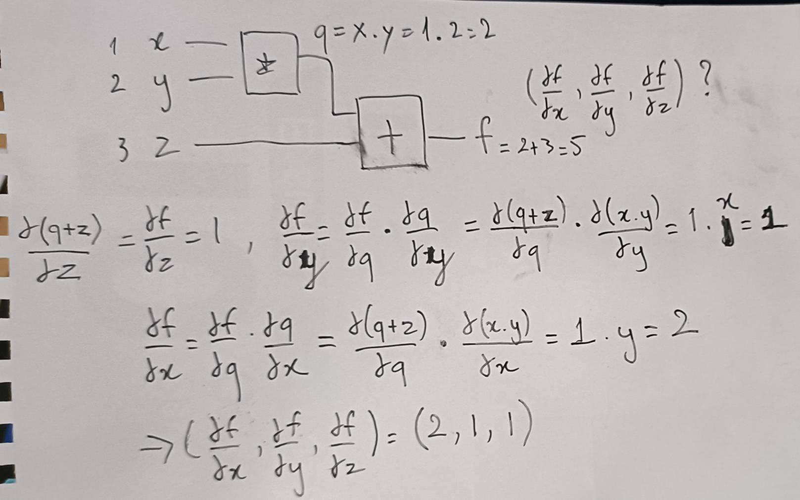

# Backpropagation
In machine learning, backpropagation is a gradient estimation method used to train neural network models. The gradient estimate is used by the optimization algorithm to compute the network parameter updates.
## Originally, with $n$ parameters had to be counted $n$ times, but using backpropagation can be accelerated to only 2 times (accelerated $n$ times faster)
## first time: forward (正傳遞)
## second time: backward (反傳遞)
## $f(x,y,z)=x*y+z$
